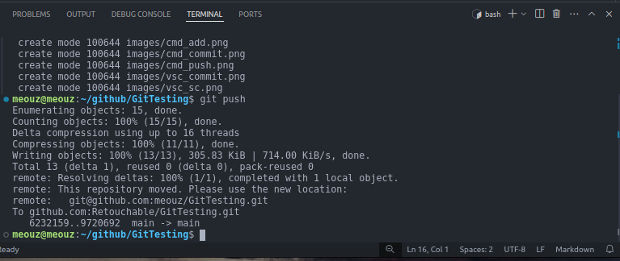

# Bagaimana Git Bekerja

git memiliki 2 tipe folder, folder global dan lokal.

folder global adalah folder yang terdapat pada server (seperti github), dan folder lokal berada pada perangkat kita.

## Kirim update dari lokal ke global

### Commit dengan Visual Studio Code
_Note: Harus login github di Vs Code (ada di settings atau Accounts)_


### Commit dengan Terminal
_Note: Harus login github di terminal_

Add satu per satu:

`git add contoh1.txt`

`git commit -m "this is messages"`

`git push origin main`


Add semua perubahan:

`git add .`

`git commit -m "this is messages"`

`git push`

_Note: usahakan `git push origin main` agar tidak mengganggu branch lain._

### Commit dengan GitHub Desktop
_Note: Harus login github di GitHub Desktop_

Centang File yang ingin di commit:

Tambahkan sedikit keterangan:

Upload perubahan:


## Ambil update dari global ke lokal

### Update menggunakan Terminal
`git pull`

### Update menggunakan GitHub Desktop

## Melihat perubahan
`git log`

## Membuat folder lokal dari folder global
copy ssh-nya
`git clone ssh`

# Proper messages (optional)
referee: https://www.atlassian.com/git/glossary#commands

<!-- # Git Clone
when you want to get the file access, you have to clone it to your local disk,
```
git clone <link_ssh>
```
you can custom the place of clone folder by navigate to your directory first.

# Git Push
to commit a file, we firstly do an add file:
```
git add <file> /*add file one by one*/
OR
git add . /*add all file*/
```

then do the commit:
```
git commit -m <message>
 /*
  give a proper message,
  referee: https://www.atlassian.com/git/glossary#commands
  */
```

finally, push updated changes.
```
git push origin <branch>
```

# Git Pull
to check whether origin branch have any changes
```
git pull origin <branch>
```

# Git Checkout
to change current branch
```
git checkout <branch>
```

# Git Branch
check existing branch and current branch (for local):
```
git branch
```

create a new branch:
```
git branch <name>
```

# Git Merge
Merge another branch to current branch:

firstly, change the branch to target merge:
```
git checkout <branch>
```

Make sure there's nothing changes in that origin:
```
git pull origin <branch>
```

Lastly, we can just merge it by: 
```
git merge <branch>
```

# Git Log
show history and get the commit_code:
```
git log
```

# Git Reset
whenever you want to undo commit:
```
git reset <commit_code>
```

to get commit_code, use git log.

# Git Revert (avoid using this code)
ubah si head dari up-to-date ke versi commit yang kita mau
```
git revert <commit_code>
```

to get commit_code, use git log.

# Set SSH to github
referee: https://gist.github.com/xirixiz/b6b0c6f4917ce17a90e00f9b60566278 -->
